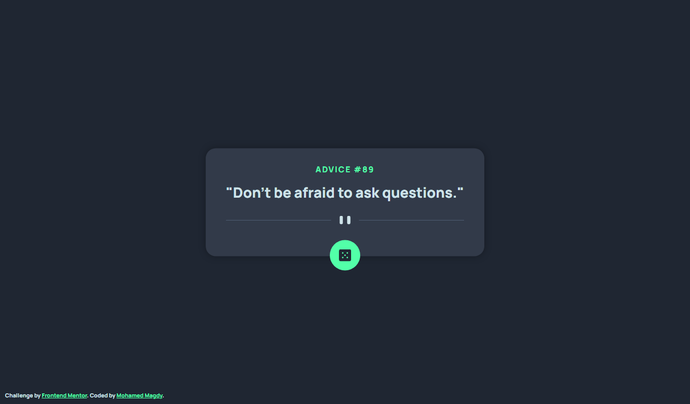

# Frontend Mentor - Advice generator app solution

This is a solution to the [Advice generator app challenge on Frontend Mentor](https://www.frontendmentor.io/challenges/advice-generator-app-QdUG-13db). Frontend Mentor challenges help you improve your coding skills by building realistic projects.

## Table of contents

- [Overview](#overview)
  - [The challenge](#the-challenge)
  - [Screenshot](#screenshot)
  - [Links](#links)
- [My process](#my-process)
  - [Built with](#built-with)
- [Author](#author)

## Overview

### The challenge

Users should be able to:

- View the optimal layout for the app depending on their device's screen size
- See hover states for all interactive elements on the page
- Generate a new piece of advice by clicking the dice icon

### Screenshot

### Links

- Solution URL: [Github](https://github.com/moamed018/Frontend-Mentor-Advice-generator-app)
- Frontend Mentor URL: [Frontend Mentor](https://www.frontendmentor.io/solutions/advice-generator-app-using-html-css-js-and-api-2Q5Im54PEs)
- Live Site URL: [Github Pages](https://moamed018.github.io/Frontend-Mentor-Advice-generator-app/)

## My process

### Built with

- Semantic HTML5 markup
- CSS custom properties
- Flexbox
- Vanilla Javascript
- API with [Advice Slip JSON API](https://api.adviceslip.com/)

## Author

- Mohamed Madgy
- Frontend Mentor - [@moamed018](https://www.frontendmentor.io/profile/moamed018)
- Twitter - [@mmagdy_01612](https://twitter.com/mmagdy_01612)
